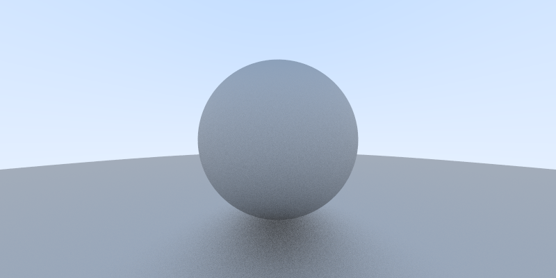

# Basic Raytracer

Current output:

A basic raytracer, written to learn rust. Based off of the guide [Raytracing in a Weekend](http://www.realtimerendering.com/raytracing/).

No material system currently in place. It renders some diffuse spheres, that's all.